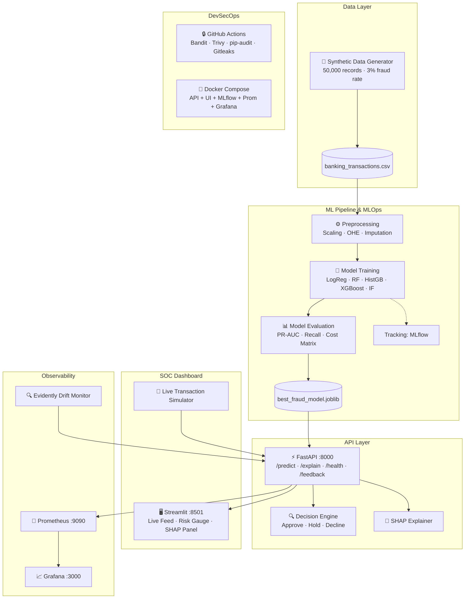
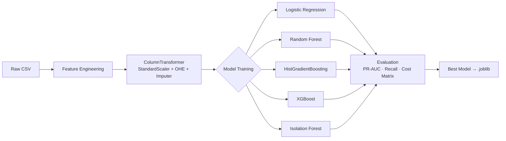

# 🛡️ FraudShield — Real-Time Banking Transaction Fraud Detection

> **Disclaimer**: This project is for education, research, portfolio, and software-engineering demonstration purposes only. All data is synthetically generated. No real account numbers, card numbers, personal names, IP addresses, or payment tokens are used.

---

## 📌 Overview

**FraudShield** is a production-style, end-to-end **DevSecMLOps** platform for detecting fraudulent banking transactions in real time. It combines a machine learning backend, a live **SOC Analyst Dashboard**, automated CI/CD security pipelines, and full observability — all deployable with a single `make` command.

---

## 🏗️ Architecture



---

## 🖥️ SOC Analyst Dashboard

The dashboard is a stunning, dark-themed real-time interface designed for Security Operations Center analysts.

| Panel | Description |
|---|---|
| **KPI Cards** | Live counts: Transactions Monitored, Fraud Prevented ($), Critical Alerts |
| **Live Feed Table** | Color-coded rows — 🟢 Low / 🟡 Medium / 🟠 High / 🔴 Critical |
| **Risk Gauge** | Plotly speedometer from 0–100% with animated threshold zones |
| **SHAP Panel** | Horizontal bar chart showing the top 12 features that influenced the score |
| **Decision Buttons** | `[✅ Approve]` `[🔐 Step-Up Auth]` `[⏸️ Hold]` `[🚫 Decline]` with full audit log |
| **Risk Distribution** | Histogram of all risk scores in the current feed |

---

## 📁 Repository Structure

```
banking_fraud_detection/
├── .github/
│   └── workflows/
│       ├── ci_cd.yml              # Lint, test, build
│       ├── security_scan.yml      # Bandit, Trivy, pip-audit, Gitleaks
│       └── retraining.yml         # Scheduled model retraining
├── api/
│   ├── main.py                    # FastAPI app with /predict, /explain, /batch_predict
│   ├── schemas.py                 # Pydantic models (input/output)
│   └── decision_engine.py         # Rule-based risk decision
├── configs/
│   └── config.yaml                # Model config, thresholds, feature lists
├── data/
│   └── raw/                       # banking_transactions.csv (generated)
├── infrastructure/
│   ├── Dockerfile                 # Secure API container (non-root)
│   ├── docker-compose.yml         # API + UI + Prometheus + Grafana
│   └── prometheus.yml             # Prometheus scrape config
├── models/                        # Serialized model pipeline
├── pipelines/
│   └── train_pipeline.py          # End-to-end ML training orchestrator
├── scripts/
│   └── generate_data.py           # 50k synthetic banking records
├── src/
│   ├── data_preprocessing.py      # Scikit-learn preprocessing pipeline
│   ├── features.py                # Feature engineering
│   ├── model_training.py          # 5 model trainers
│   ├── model_evaluation.py        # PR-AUC, Recall, Cost Matrix
│   ├── explainability.py          # SHAP wrapper
│   └── drift_monitor.py           # Evidently drift detection
├── tests/
│   ├── test_api.py
│   └── test_data_pipeline.py
├── ui/
│   ├── app.py                     # Streamlit SOC Dashboard (the UI)
│   ├── simulator.py               # Live transaction generator
│   ├── Dockerfile                 # Streamlit container
│   └── requirements.txt
├── Makefile
├── README.md
└── requirements.txt
```

---

## 🚀 Quickstart (Local)

### Prerequisites
- Python 3.11+
- Git

```bash
# 1. Clone the repository
git clone https://github.com/GannojiSathvik/Mldevops.git
cd Mldevops/banking_fraud_detection

# 2. Create virtual environment
python -m venv venv
source venv/bin/activate   # Windows: venv\Scripts\activate

# 3. Install all dependencies
pip install -r requirements.txt
pip install -r ui/requirements.txt

# 4. Generate synthetic dataset
make generate-data

# 5. Train the ML models
make train

# 6. Start the API backend (in Terminal 1)
make run-api

# 7. Start the SOC Dashboard (in Terminal 2)
make run-ui
```

### Access Points
| Service | URL |
|---|---|
| 🖥️ SOC Dashboard | http://localhost:8501 |
| ⚡ FastAPI Docs (Swagger) | http://localhost:8000/docs |
| 📡 Prometheus | http://localhost:9090 |
| 📈 Grafana | http://localhost:3000 |

---

## 🐳 Docker (One-Command Stack)

```bash
# Build and start the full stack
make run-stack

# Or directly:
docker-compose -f infrastructure/docker-compose.yml up -d

# Stop
docker-compose -f infrastructure/docker-compose.yml down
```

---

## 📡 API Usage Examples

### Predict a Transaction
```bash
curl -X POST http://localhost:8000/api/v1/predict \
  -H "Content-Type: application/json" \
  -d '{
    "transaction_id": "txn-001",
    "timestamp": "2025-01-01T10:00:00",
    "channel": "mobile",
    "transaction_type": "transfer",
    "customer_id": "cust-abc",
    "age": 35,
    "gender": "M",
    "income_band": "medium",
    "kyc_pep_status": 0,
    "account_id": "acc-xyz",
    "account_type": "checking",
    "balance_before": 5000.0,
    "balance_after": 200.0,
    "avg_30d_amount": 300.0,
    "amount_to_avg_ratio": 15.66,
    "amount": 4800.0,
    "transaction_fee": 48.0,
    "card_id": "card-001",
    "card_type": "debit",
    "network": "visa",
    "merchant_category": "travel",
    "is_cross_border": 1,
    "merchant_risk_level": "high",
    "device_id": "dev-001",
    "os": "android",
    "browser": "chrome",
    "is_vpn_proxy": 1,
    "ip_risk_score": 92.5,
    "public_wifi": 1,
    "distance_from_home_km": 12000.0,
    "auth_method": "none",
    "otp_failed_attempts": 3,
    "login_session_age_mins": 1.2,
    "previous_fraud_history": 0
  }'
```

**Response:**
```json
{
  "transaction_id": "txn-001",
  "risk_score": 0.97,
  "decision": "Decline"
}
```

### Get SHAP Explanation
```bash
curl -X POST http://localhost:8000/api/v1/explain \
  -H "Content-Type: application/json" \
  -d '{ ... same payload as /predict ... }'
```

**Response:**
```json
{
  "transaction_id": "txn-001",
  "risk_score": 0.97,
  "decision": "Decline",
  "shap_values": {
    "ip_risk_score": 0.38,
    "distance_from_home_km": 0.31,
    "is_vpn_proxy": 0.19,
    "amount_to_avg_ratio": 0.14,
    "otp_failed_attempts": 0.11
  }
}
```

---

## 🤖 Machine Learning Pipeline



### Risk Decision Thresholds (configurable in `configs/config.yaml`)
| Risk Band | Score Range | Decision |
|---|---|---|
| 🟢 Low | 0% – 40% | Approve |
| 🟡 Medium | 40% – 60% | Approve (monitor) |
| 🟠 High | 60% – 80% | Hold / Step-Up Auth |
| 🔴 Critical | 80% – 100% | Decline |

---

## 🔒 Security Pipeline (GitHub Actions)

| Workflow | Trigger | Tools |
|---|---|---|
| `ci_cd.yml` | Push / PR | flake8, pytest, Docker build |
| `security_scan.yml` | Push / PR | Bandit (SAST), Trivy (CVE scan), pip-audit, Gitleaks |
| `retraining.yml` | Weekly (Sunday) | Full pipeline retrain + model evaluation |

---

## 📊 Monitoring & Drift Detection

- **Prometheus** scrapes the `/metrics` endpoint every 15s
- **Grafana** dashboards show: prediction latency, fraud rate, error rate
- **Evidently** monitors feature drift + target drift between reference and current data batches; triggers retraining when >30% of features drift

---

## 🛡️ Security Design Principles

- ✅ Non-root Docker users (`appuser`)
- ✅ No hardcoded credentials
- ✅ Input sanitization via Pydantic validators
- ✅ Least-privilege containers
- ✅ SAST scanning on every commit (Bandit)
- ✅ Dependency vulnerability scanning (pip-audit, Trivy)
- ✅ Secret leak detection (Gitleaks)

---

## 📜 License & Disclaimer

MIT License · For educational and research use only. All transaction data is synthetically generated with no real PII.
